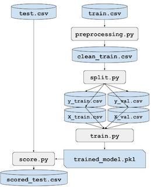

# job-python-skeleton

[](https://travis-ci.com/project-workflow-kubernetes/job-python-skeleton)

This repository contains a skeleton of python project which will be registred in [workflow](https://github.com/project-workflow-kubernetes/workflow-controler).

### Dependencies

Please, install:
- [travis](https://github.com/travis-ci/travis.rb#installation) which will deal with build and push of docker images
- [Git Large File Storage](https://git-lfs.github.com/) which will make github deal efficiently with large files. `brew install git-lfs`

Besides that, you should have an account in some docker repository like [Docker Hub](https://hub.docker.com/) or [quay.io](https://quay.io/). Your docker username and password will be sent to travis push your docker image. We might also set as environment variables `$DOCKER_USERNAME` and `$DOCKER_PASSWORD`.


### Setup
To setup your own project you should choose a name to your job (e.g. `my-job`) and:

1. Fork this repository
2. In your forked repository go to `settings` and change the field `Repository name` to `my-job` and click on `Rename`
3. Clone the new repository in our machine
4. If you have the environment variables `$DOCKER_USERNAME` and `$DOCKER_PASSWORD` set you can just run:
```bash
bash .bootstrap -j my-job up
```
If you don't have those variables set yet, run:
```bash
bash .bootstrap -j my-job -u DOCKER_USERNAME -p DOCKER_PASSWORD up
```

> **NOTE**: To undo changes: `bash .bootstrap -j my-job down`

> **NOTE**: If it is needed generate travis secrets again: `bash .bootstrap -j my-job generate-secrets`

5. Configure Travis CI to access this repository or all your repositories [here](https://github.com/apps/travis-ci)
6. Go to github `Settings > Applications > Authorized OAuth Apps` and check if `travis-pro` is listed
7. Commit your changes and check in [travis](https://travis-ci.com/) if there is some build happening
8. Put all your data inside the folder `/data`
9. Put all your code inside the folder `/src/my-job/`
10. Fill `dependencies.yaml` file that must contain all dependency structure of your job.

For each task (or script), you should specify a list of inputs, list of outputs, the docker image related with this task and finally the command to run the task inside the container. All the inputs files must be in the folder `/data/` and all tasks must be in `/src/my-job/`.

The following diagram or job:



will result in the dependencies file available [here](https://github.com/project-workflow-kubernetes/job-python/blob/master/dependencies.yaml).

11. Commit your changes and check in [travis](https://travis-ci.com/) if the build was successful


> **NOTE**: Your dependencies must be a DAG (Directed Acyclic Graph)

> **NOTE**: If you need to install new python packages, add them in `setup.py` or `requirements.txt`
